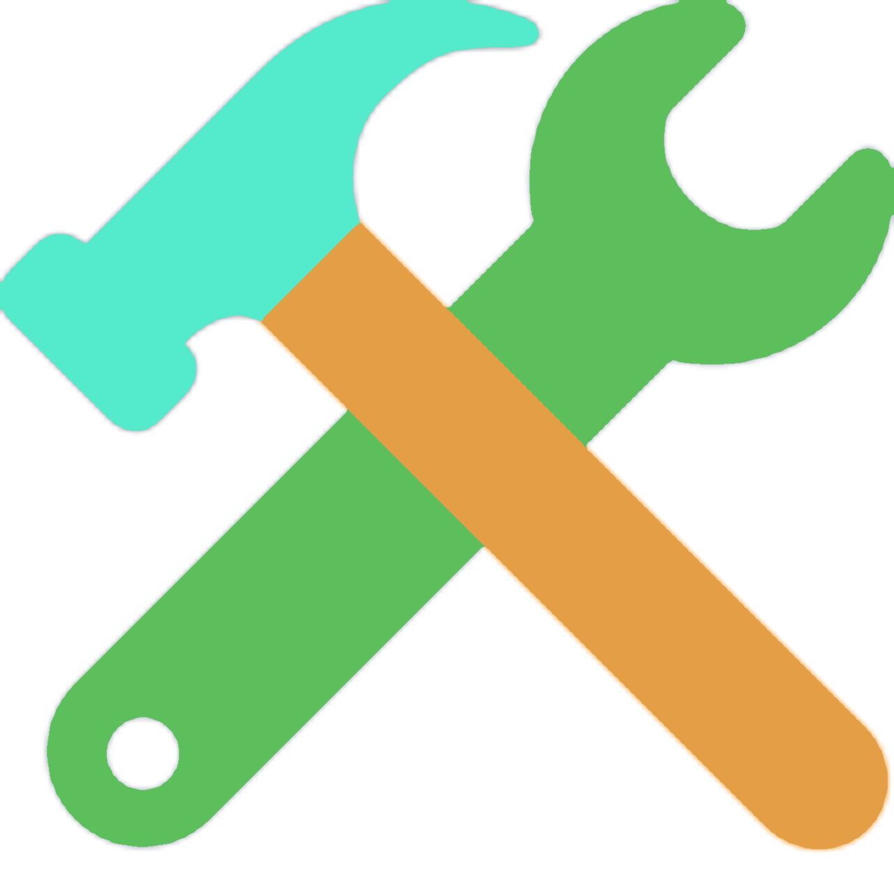
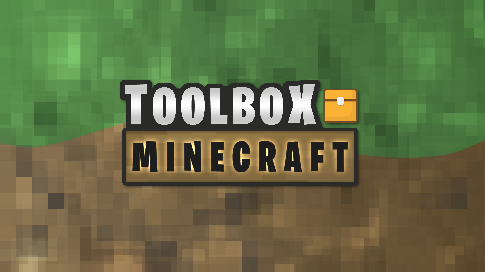
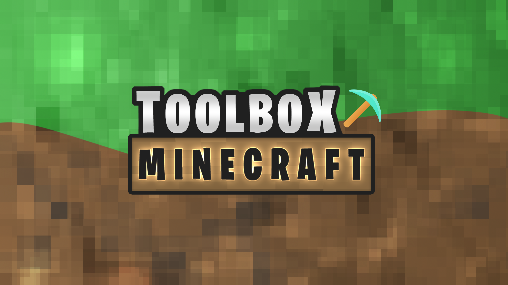

## Toolbox Archived Media

  <h3>General Archives</h3>
  

    <a class="home-content-container" style="border-radius:8px;background:#111;padding:8px;color:#ccc;display:inline-block;margin:4px;line-height:0;--color:#00bc88">
      
VIP

      
#00bc88

    </a>
    <a class="home-content-container" style="border-radius:8px;background:#111;padding:8px;color:#ccc;display:inline-block;margin:4px;line-height:0;--color:#bdee7a">
      
Premium

      
#bdee7a

    </a>
    <a class="home-content-container" style="border-radius:8px;background:#111;padding:8px;color:#ccc;display:inline-block;margin:4px;line-height:0;--color:#62d667">
      
Toolbox Helper

      
#62d667

    </a>
    

      
    

  

  <h3>Toolbox Events</h3>
  

    <a class="home-content-container" style="border-radius:8px;background:#111;padding:8px;color:#ccc;display:inline-block;margin:4px;line-height:0;--color:#e74c3c">
      
Lava Rising Champion

      
#e74c3c

    </a>
    <a class="home-content-container" style="border-radius:8px;background:#111;padding:8px;color:#ccc;display:inline-block;margin:4px;line-height:0;--color:#00ffff">
      
Skribbl Champion

      
#00ffff

    </a>
    <a class="home-content-container" style="border-radius:8px;background:#111;padding:8px;color:#ccc;display:inline-block;margin:4px;line-height:0;--color:#7426ec">
      
Build Battle King

      
#7426ec

    </a>
    <a class="home-content-container" style="border-radius:8px;background:#111;padding:8px;color:#ccc;display:inline-block;margin:4px;line-height:0;--color:#26c1ec">
      
Spleef Sovereign

      
#26c1ec

    </a>
    <a class="home-content-container" style="border-radius:8px;background:#111;padding:8px;color:#ccc;display:inline-block;margin:4px;line-height:0;--color:#1f9409">
      
Hunger Games Hero

      
#1f9409

    </a>
    <a class="home-content-container" style="border-radius:8px;background:#111;padding:8px;color:#ccc;display:inline-block;margin:4px;line-height:0;--color:#f1c40f">
      
PVP King

      
#f1c40f

    </a>
  

  <h3>Pride Month 2023</h3>
  

    

      
    

  

  <h3>Toolbox 2023</h3>
  

    

      
      
      
      
    

  

  <h3>Christmas 2022</h3>
  

    <a class="home-content-container" style="border-radius:8px;background:#111;padding:8px;color:#ccc;display:inline-block;margin:4px;line-height:0;--color:#f8ecec">
      
Snowball White

      
#f8ecec

    </a>
    <a class="home-content-container" style="border-radius:8px;background:#111;padding:8px;color:#ccc;display:inline-block;margin:4px;line-height:0;--color:#f1c40f">
      
Gold Ornament

      
#f1c40f

    </a>
    <a class="home-content-container" style="border-radius:8px;background:#111;padding:8px;color:#ccc;display:inline-block;margin:4px;line-height:0;--color:#d32323">
      
Red Stocking

      
#d32323

    </a>
    <a class="home-content-container" style="border-radius:8px;background:#111;padding:8px;color:#ccc;display:inline-block;margin:4px;line-height:0;--color:#267f00">
      
Green Tree

      
#267f00

    </a>
    

      
      
      
    

  

  <h3>Halloween 2022</h3>
  

    <a class="home-content-container" style="border-radius:8px;background:#111;padding:8px;color:#ccc;display:inline-block;margin:4px;line-height:0;--color:#ff7d25">
      
Pumpkin Orange

      
#ff7d25

    </a>
    <a class="home-content-container" style="border-radius:8px;background:#111;padding:8px;color:#ccc;display:inline-block;margin:4px;line-height:0;--color:#7d0cd7">
      
Potion Purple

      
#7d0cd7

    </a>
    <a class="home-content-container" style="border-radius:8px;background:#111;padding:8px;color:#ccc;display:inline-block;margin:4px;line-height:0;--color:#98fe35">
      
Acid Green

      
#98fe35

    </a>
    <a class="home-content-container" style="border-radius:8px;background:#eee;padding:8px;color:#ccc;display:inline-block;margin:4px;line-height:0;--color:#29292c">
      
Midnight Black

      
#29292c

    </a>
    

      
      
    

  

  <h3>2022 Level Roles</h3>
  

    <a class="home-content-container" style="border-radius:8px;background:#111;padding:8px;color:#ccc;display:inline-block;margin:4px;line-height:0;--color:#865f04">
      
Wood

      
#865f04

    </a>
    <a class="home-content-container" style="border-radius:8px;background:#000;padding:8px;color:#ccc;display:inline-block;margin:4px;line-height:0;--color:#646464">
      
Stone

      
#646464

    </a>
    <a class="home-content-container" style="border-radius:8px;background:#111;padding:8px;color:#ccc;display:inline-block;margin:4px;line-height:0;--color:#dadada">
      
Iron

      
#dadada

    </a>
    <a class="home-content-container" style="border-radius:8px;background:#111;padding:8px;color:#ccc;display:inline-block;margin:4px;line-height:0;--color:#ffcf00">
      
Gold

      
#ffcf00

    </a>
    <a class="home-content-container" style="border-radius:8px;background:#111;padding:8px;color:#ccc;display:inline-block;margin:4px;line-height:0;--color:#28eed3">
      
Diamond

      
#28eed3

    </a>
    <a class="home-content-container" style="border-radius:8px;background:#eee;padding:8px;color:#ccc;display:inline-block;margin:4px;line-height:0;--color:#3a3131">
      
Netherite

      
#3a3131

    </a>
  

  <h3>Toolbox 2022</h3>
  

    

      
      
    

  

  <h3>Christmas 2021</h3>
  

    <a class="home-content-container" style="border-radius:8px;background:#111;padding:8px;color:#ccc;display:inline-block;margin:4px;line-height:0;--color:#ffffff">
      
Silver Snowman

      
#ffffff

    </a>
    <a class="home-content-container" style="border-radius:8px;background:#111;padding:8px;color:#ccc;display:inline-block;margin:4px;line-height:0;--color:#ffc91f">
      
Golden Star

      
#ffc91f

    </a>
    <a class="home-content-container" style="border-radius:8px;background:#111;padding:8px;color:#ccc;display:inline-block;margin:4px;line-height:0;--color:#1d7f32">
      
Mistletoe Wreath

      
#1d7f32

    </a>
    <a class="home-content-container" style="border-radius:8px;background:#111;padding:8px;color:#ccc;display:inline-block;margin:4px;line-height:0;--color:#e00202">
      
Ruby Ribbon

      
#e00202

    </a>
    

      
      
    

  

  <h3>50k Event Roles</h3>
  

    <a class="home-content-container" style="border-radius:8px;background:#111;padding:8px;color:#ccc;display:inline-block;margin:4px;line-height:0;--color:#51e8cb">
      
Toolbox Teal

      
#51e8cb

    </a>
    <a class="home-content-container" style="border-radius:8px;background:#111;padding:8px;color:#ccc;display:inline-block;margin:4px;line-height:0;--color:#68d468">
      
Toolbox Green

      
#68d468

    </a>
    <a class="home-content-container" style="border-radius:8px;background:#111;padding:8px;color:#ccc;display:inline-block;margin:4px;line-height:0;--color:#ab825e">
      
Toolbox Brown

      
#ab825e

    </a>
    <a class="home-content-container" style="border-radius:8px;background:#111;padding:8px;color:#ccc;display:inline-block;margin:4px;line-height:0;--color:#e1963f">
      
Toolbox Orange

      
#e1963f

    </a>
  

  <h3>April Fools 2021</h3>
  

    

      
    

  

  <h3>2021 Level Roles</h3>
  

    <a class="home-content-container" style="border-radius:8px;background:#111;padding:8px;color:#ccc;display:inline-block;margin:4px;line-height:0;--color:#949494">
      
Common

      
#949494

    </a>
    <a class="home-content-container" style="border-radius:8px;background:#111;padding:8px;color:#ccc;display:inline-block;margin:4px;line-height:0;--color:#00cf2a">
      
Uncommon

      
#00cf2a

    </a>
    <a class="home-content-container" style="border-radius:8px;background:#111;padding:8px;color:#ccc;display:inline-block;margin:4px;line-height:0;--color:#005cff">
      
Rare

      
#005cff

    </a>
    <a class="home-content-container" style="border-radius:8px;background:#111;padding:8px;color:#ccc;display:inline-block;margin:4px;line-height:0;--color:#892aff">
      
Epic

      
#892aff

    </a>
    <a class="home-content-container" style="border-radius:8px;background:#111;padding:8px;color:#ccc;display:inline-block;margin:4px;line-height:0;--color:#ffb500">
      
Legendary

      
#ffb500

    </a>
    <a class="home-content-container" style="border-radius:8px;background:#111;padding:8px;color:#ccc;display:inline-block;margin:4px;line-height:0;--color:#e73500">
      
Mythic

      
#e73500

    </a>
  

  <h3>Staff Colored Roles</h3>
  

    <a class="home-content-container" style="border-radius:8px;background:#111;padding:8px;color:#ccc;display:inline-block;margin:4px;line-height:0;--color:#2ed676">
      
STAFF Matrix Green

      
#2ed676

    </a>
    <a class="home-content-container" style="border-radius:8px;background:#111;padding:8px;color:#ccc;display:inline-block;margin:4px;line-height:0;--color:#ff1044">
      
STAFF Red

      
#ff1044

    </a>
    <a class="home-content-container" style="border-radius:8px;background:#111;padding:8px;color:#ccc;display:inline-block;margin:4px;line-height:0;--color:#ff6800">
      
STAFF Orange

      
#ff6800

    </a>
    <a class="home-content-container" style="border-radius:8px;background:#111;padding:8px;color:#ccc;display:inline-block;margin:4px;line-height:0;--color:#c8ff50">
      
STAFF Yellow

      
#c8ff50

    </a>
    <a class="home-content-container" style="border-radius:8px;background:#111;padding:8px;color:#ccc;display:inline-block;margin:4px;line-height:0;--color:#8fff3f">
      
STAFF Green

      
#8fff3f

    </a>
    <a class="home-content-container" style="border-radius:8px;background:#111;padding:8px;color:#ccc;display:inline-block;margin:4px;line-height:0;--color:#254cff">
      
STAFF Blue

      
#254cff

    </a>
    <a class="home-content-container" style="border-radius:8px;background:#111;padding:8px;color:#ccc;display:inline-block;margin:4px;line-height:0;--color:#8000ff">
      
STAFF Violet

      
#8000ff

    </a>
    <a class="home-content-container" style="border-radius:8px;background:#111;padding:8px;color:#ccc;display:inline-block;margin:4px;line-height:0;--color:#ff00e6">
      
STAFF Pink

      
#ff00e6

    </a>
    <a class="home-content-container" style="border-radius:8px;background:#111;padding:8px;color:#ccc;display:inline-block;margin:4px;line-height:0;--color:#fff">
      
STAFF White

      
#ffffff

    </a>
    <a class="home-content-container" style="border-radius:8px;background:#eee;padding:8px;color:#ccc;display:inline-block;margin:4px;line-height:0;--color:#181818">
      
STAFF Black

      
#181818

    </a>
  

  <h3>Colored Roles</h3>
  

    <a class="home-content-container" style="border-radius:8px;background:#111;padding:8px;color:#ccc;display:inline-block;margin:4px;line-height:0;--color:#e66c6c">
      
Pastel Red

      
#e66c6c

    </a>
    <a class="home-content-container" style="border-radius:8px;background:#111;padding:8px;color:#ccc;display:inline-block;margin:4px;line-height:0;--color:#ee936a">
      
Pastel Orange

      
#ee936a

    </a>
    <a class="home-content-container" style="border-radius:8px;background:#111;padding:8px;color:#ccc;display:inline-block;margin:4px;line-height:0;--color:#f3ffa2">
      
Pastel Yellow

      
#f3ffa2

    </a>
    <a class="home-content-container" style="border-radius:8px;background:#111;padding:8px;color:#ccc;display:inline-block;margin:4px;line-height:0;--color:#aced98">
      
Pastel Green

      
#aced98

    </a>
    <a class="home-content-container" style="border-radius:8px;background:#111;padding:8px;color:#ccc;display:inline-block;margin:4px;line-height:0;--color:#6e84ff">
      
Pastel Blue

      
#6e84ff

    </a>
    <a class="home-content-container" style="border-radius:8px;background:#111;padding:8px;color:#ccc;display:inline-block;margin:4px;line-height:0;--color:#9167ff">
      
Pastel Violet

      
#9167ff

    </a>
    <a class="home-content-container" style="border-radius:8px;background:#111;padding:8px;color:#ccc;display:inline-block;margin:4px;line-height:0;--color:#e37ce7">
      
Pastel Pink

      
#e37ce7

    </a>
    <a class="home-content-container" style="border-radius:8px;background:#111;padding:8px;color:#ccc;display:inline-block;margin:4px;line-height:0;--color:#a6efef">
      
Pastel Cyan

      
#a6efef

    </a>
    <a class="home-content-container" style="border-radius:8px;background:#eee;padding:8px;color:#ccc;display:inline-block;margin:4px;line-height:0;--color:#282828">
      
Pastel Black

      
#282828

    </a>
  

  <h3>Toolbox 2021</h3>
  

    

      
      
    

  

  <h3>Toolbox 2020</h3>
  

    

      
    

  

  <h3>Toolbox 2019</h3>
  

    

      
    

  

