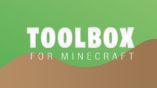
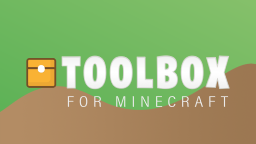
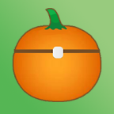
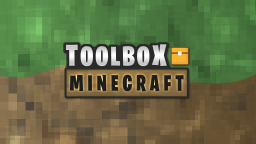
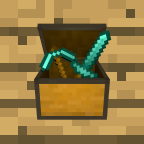

## Toolbox Archived Media

  <a class="home-content-container" style="border-radius:8px;background: #62d6674d;padding:8px;color:#ccc;display:inline-block;margin:4px;line-height:0;border: 1px solid #62d667;">
    
This archive is incomplete, and unofficial. Not endorsed by Toolbox.

  </a>

  <h3>General Archives</h3>
  

    <a class="home-content-container" style="border-radius:8px;background: #cccccc4d;padding:8px;color:#ccc;display:inline-block;margin:4px;line-height:0;border: 1px solid #ccc;">
      
Uncategorized roles and icons. I have no idea where else to put these.

    </a>
  

  

    <a class="home-content-container" style="border-radius:8px;background:#00bc884d;padding:8px;color:#ccc;display:inline-block;margin:4px;line-height:0;--color:#00bc88">
      
VIP

      
#00bc88

    </a>
    <a class="home-content-container" style="border-radius:8px;background:#bdee7a4d;padding:8px;color:#ccc;display:inline-block;margin:4px;line-height:0;--color:#bdee7a">
      
Premium

      
#bdee7a

    </a>
    <a class="home-content-container" style="border-radius:8px;background:#62d6674d;padding:8px;color:#ccc;display:inline-block;margin:4px;line-height:0;--color:#62d667">
      
Toolbox Helper

      
#62d667

    </a>
    <a class="home-content-container" style="border-radius:8px;background:#7598b94d;padding:8px;color:#ccc;display:inline-block;margin:4px;line-height:0;--color:#7598b9">
      
OG

      
#7598b9

    </a>
    <a class="home-content-container" style="border-radius:8px;background:#00ff9e4d;padding:8px;color:#ccc;display:inline-block;margin:4px;line-height:0;--color:#00ff9e">
      
Kewl Kid

      
#00ff9e

    </a>
    <a class="home-content-container" style="border-radius:8px;background:#e67e224d;padding:8px;color:#ccc;display:inline-block;margin:4px;line-height:0;--color:#e67e22">
      
Ex Staff

      
#e67e22

    </a>
    <a class="home-content-container" style="border-radius:8px;background:#1222004d;padding:8px;color:#ccc;display:inline-block;margin:4px;line-height:0;--color:#122200">
      
Epic Tester

      
#122200

    </a>
    <a class="home-content-container" style="border-radius:8px;background:#cccccc4d;padding:8px;color:#ccc;display:inline-block;margin:4px;line-height:0;--color:#ccc">
      
Bot Dev

      
#unarchived

    </a>
  

  <h3>Toolbox Events</h3>
  

    <a class="home-content-container" style="border-radius:8px;background: #cccccc4d;padding:8px;color:#ccc;display:inline-block;margin:4px;line-height:0;border: 1px solid #ccc;">
      
Toolbox hosts Minecraft events sometimes, often with a temporary role as a reward.

    </a>
  

  

    <a class="home-content-container" style="border-radius:8px;background:#e74c3c4d;padding:8px;color:#ccc;display:inline-block;margin:4px;line-height:0;--color:#e74c3c">
      
Lava Rising Champion

      
#e74c3c

    </a>
    <a class="home-content-container" style="border-radius:8px;background:#00ffff4d;padding:8px;color:#ccc;display:inline-block;margin:4px;line-height:0;--color:#00ffff">
      
Skribbl Champion

      
#00ffff

    </a>
    <a class="home-content-container" style="border-radius:8px;background:#7426ec4d;padding:8px;color:#ccc;display:inline-block;margin:4px;line-height:0;--color:#7426ec">
      
Build Battle King

      
#7426ec

    </a>
    <a class="home-content-container" style="border-radius:8px;background:#26c1ec4d;padding:8px;color:#ccc;display:inline-block;margin:4px;line-height:0;--color:#26c1ec">
      
Spleef Sovereign

      
#26c1ec

    </a>
    <a class="home-content-container" style="border-radius:8px;background:#1f94094d;padding:8px;color:#ccc;display:inline-block;margin:4px;line-height:0;--color:#1f9409">
      
Hunger Games Hero

      
#1f9409

    </a>
    <a class="home-content-container" style="border-radius:8px;background:#f1c40f4d;padding:8px;color:#ccc;display:inline-block;margin:4px;line-height:0;--color:#f1c40f">
      
PVP King

      
#f1c40f

    </a>
  

  <h3>2023 Level Roles</h3>
  

    <a class="home-content-container" style="border-radius:8px;background: #cccccc4d;padding:8px;color:#ccc;display:inline-block;margin:4px;line-height:0;border: 1px solid #ccc;">
      
Reintroduction of the 2022 ranking system after prior changes in 2023 were disliked by many.

    </a>
  

  

    <a class="home-content-container" style="border-radius:8px;background: #85684a4d;padding:8px;color:#ccc;display:inline-block;margin:4px;line-height:0;--color: #85684a;">
      
Wood

      
#85684a

    </a>
    <a class="home-content-container" style="border-radius:8px;background: #4444444d;padding:8px;color:#ccc;display:inline-block;margin:4px;line-height:0;--color: #444444;">
      
Stone

      
#444444

    </a>
    <a class="home-content-container" style="border-radius:8px;background: #9c9c9c4d;padding:8px;color:#ccc;display:inline-block;margin:4px;line-height:0;--color: #9c9c9c;">
      
Iron

      
#9c9c9c

    </a>
    <a class="home-content-container" style="border-radius:8px;background: #eec50c4d;padding:8px;color:#ccc;display:inline-block;margin:4px;line-height:0;--color: #eec50c;">
      
Gold

      
#eec50c

    </a>
    <a class="home-content-container" style="border-radius:8px;background: #22e7d74d;padding:8px;color:#ccc;display:inline-block;margin:4px;line-height:0;--color: #22e7d7;">
      
Diamond

      
#22e7d7

    </a>
    <a class="home-content-container" style="border-radius:8px;background: #201a1a4d;padding:8px;color:#ccc;display:inline-block;margin:4px;line-height:0;--color: #201a1a;">
      
Netherite

      
#201a1a

    </a>
  

  <h3>Pride Month 2023</h3>
  

    <a class="home-content-container" style="border-radius:8px;background: #cccccc4d;padding:8px;color:#ccc;display:inline-block;margin:4px;line-height:0;border: 1px solid #ccc;">
      
The first time Toolbox celebrated Pride Month.

    </a>
  

  

    

      
    

  

  <h3>2023 Color Roles</h3>
  

    <a class="home-content-container" style="border-radius:8px;background: #cccccc4d;padding:8px;color:#ccc;display:inline-block;margin:4px;line-height:0;border: 1px solid #ccc;">
      
The choice of color wasn't a bad idea, so it returns to Toolbox.

    </a>
  

  

    <a class="home-content-container" style="border-radius:8px;background:#4e4d4e4d;padding:8px;color:#ccc;display:inline-block;margin:4px;line-height:0;--color:#4e4d4e">
      
Oreo Cookies

      
#4e4d4e

    </a>
    <a class="home-content-container" style="border-radius:8px;background:#eeeeee4d;padding:8px;color:#ccc;display:inline-block;margin:4px;line-height:0;--color:#eee">
      
Classic Marshmellows

      
#eeeeee

    </a>
    <a class="home-content-container" style="border-radius:8px;background:#ff72724d;padding:8px;color:#ccc;display:inline-block;margin:4px;line-height:0;--color:#ff7272">
      
Strawberry Wafers

      
#ff7272

    </a>
    <a class="home-content-container" style="border-radius:8px;background:#ffac434d;padding:8px;color:#ccc;display:inline-block;margin:4px;line-height:0;--color:#ffac43">
      
Orange Creamsicles

      
#ffac43

    </a>
    <a class="home-content-container" style="border-radius:8px;background:#f2ff764d;padding:8px;color:#ccc;display:inline-block;margin:4px;line-height:0;--color:#f2ff76">
      
Buttery Popcorn

      
#f2ff76

    </a>
    <a class="home-content-container" style="border-radius:8px;background:#94ff904d;padding:8px;color:#ccc;display:inline-block;margin:4px;line-height:0;--color:#94ff90">
      
Lime Sherbert

      
#94ff90

    </a>
    <a class="home-content-container" style="border-radius:8px;background:#92f7ff4d;padding:8px;color:#ccc;display:inline-block;margin:4px;line-height:0;--color:#92f7ff">
      
Cotton Candy

      
#92f7ff

    </a>
    <a class="home-content-container" style="border-radius:8px;background:#6ba0ff4d;padding:8px;color:#ccc;display:inline-block;margin:4px;line-height:0;--color:#6ba0ff">
      
Blueberry Muffin

      
#6ba0ff

    </a>
    <a class="home-content-container" style="border-radius:8px;background:#bb8dff4d;padding:8px;color:#ccc;display:inline-block;margin:4px;line-height:0;--color:#bb8dff">
      
Grape Kool-Aid

      
#bb8dff

    </a>
    <a class="home-content-container" style="border-radius:8px;background:#fda4ff4d;padding:8px;color:#ccc;display:inline-block;margin:4px;line-height:0;--color:#fda4ff">
      
Pink Starburst

      
#fda4ff

    </a>
    <a class="home-content-container" style="border-radius:8px;background:#ff006f4d;padding:8px;color:#ccc;display:inline-block;margin:4px;line-height:0;--color:#ff006f">
      
Sweet Kiss

      
#ff006f

    </a>
    <a class="home-content-container" style="border-radius:8px;background:#ec3e2f4d;padding:8px;color:#ccc;display:inline-block;margin:4px;line-height:0;--color:#ec3e2f">
      
Phoenix Flame

      
#ec3e2f

    </a>
    <a class="home-content-container" style="border-radius:8px;background:#ffc3004d;padding:8px;color:#ccc;display:inline-block;margin:4px;line-height:0;--color:#ffc300">
      
Golden Lightbringer

      
#ffc300

    </a>
    <a class="home-content-container" style="border-radius:8px;background:#8eff004d;padding:8px;color:#ccc;display:inline-block;margin:4px;line-height:0;--color:#8eff00">
      
Toxic Waste

      
#8eff00

    </a>
    <a class="home-content-container" style="border-radius:8px;background:#00ff9e4d;padding:8px;color:#ccc;display:inline-block;margin:4px;line-height:0;--color:#00ff9e">
      
Kewl Kolor

      
#00ff9e

    </a>
    <a class="home-content-container" style="border-radius:8px;background:#00acff4d;padding:8px;color:#ccc;display:inline-block;margin:4px;line-height:0;--color:#00acff">
      
Oceanic Waves

      
#00acff

    </a>
    <a class="home-content-container" style="border-radius:8px;background:#ab2ff14d;padding:8px;color:#ccc;display:inline-block;margin:4px;line-height:0;--color:#ab2ff1">
      
Majestic Aegis

      
#ab2ff1

    </a>
  

  <h3>Toolbox 2023</h3>
  

    

      
      
      
      
    

  

  <h3>Christmas 2022</h3>
  

    <a class="home-content-container" style="border-radius:8px;background:#f8ecec4d;padding:8px;color:#ccc;display:inline-block;margin:4px;line-height:0;--color:#f8ecec">
      
Snowball White

      
#f8ecec

    </a>
    <a class="home-content-container" style="border-radius:8px;background:#f1c40f4d;padding:8px;color:#ccc;display:inline-block;margin:4px;line-height:0;--color:#f1c40f">
      
Gold Ornament

      
#f1c40f

    </a>
    <a class="home-content-container" style="border-radius:8px;background:#d323234d;padding:8px;color:#ccc;display:inline-block;margin:4px;line-height:0;--color:#d32323">
      
Red Stocking

      
#d32323

    </a>
    <a class="home-content-container" style="border-radius:8px;background:#267f004d;padding:8px;color:#ccc;display:inline-block;margin:4px;line-height:0;--color:#267f00">
      
Green Tree

      
#267f00

    </a>
    

      
      
      
    

  

  <h3>Halloween 2022</h3>
  

    <a class="home-content-container" style="border-radius:8px;background: #cccccc4d;padding:8px;color:#ccc;display:inline-block;margin:4px;line-height:0;border: 1px solid #ccc;">
      
The first time Toolbox celebrated Halloween.

    </a>
  

  

    <a class="home-content-container" style="border-radius:8px;background:#ff7d254d;padding:8px;color:#ccc;display:inline-block;margin:4px;line-height:0;--color:#ff7d25">
      
Pumpkin Orange

      
#ff7d25

    </a>
    <a class="home-content-container" style="border-radius:8px;background:#7d0cd74d;padding:8px;color:#ccc;display:inline-block;margin:4px;line-height:0;--color:#7d0cd7">
      
Potion Purple

      
#7d0cd7

    </a>
    <a class="home-content-container" style="border-radius:8px;background:#98fe354d;padding:8px;color:#ccc;display:inline-block;margin:4px;line-height:0;--color:#98fe35">
      
Acid Green

      
#98fe35

    </a>
    <a class="home-content-container" style="border-radius:8px;background:#29292c4d;padding:8px;color:#ccc;display:inline-block;margin:4px;line-height:0;--color:#29292c">
      
Midnight Black

      
#29292c

    </a>
    

      
      
    

  

  <h3>2022 Level Roles</h3>
  

    <a class="home-content-container" style="border-radius:8px;background:#865f044d;padding:8px;color:#ccc;display:inline-block;margin:4px;line-height:0;--color:#865f04">
      
Wood

      
#865f04

    </a>
    <a class="home-content-container" style="border-radius:8px;background:#6464644d;padding:8px;color:#ccc;display:inline-block;margin:4px;line-height:0;--color:#646464">
      
Stone

      
#646464

    </a>
    <a class="home-content-container" style="border-radius:8px;background:#dadada4d;padding:8px;color:#ccc;display:inline-block;margin:4px;line-height:0;--color:#dadada">
      
Iron

      
#dadada

    </a>
    <a class="home-content-container" style="border-radius:8px;background:#ffcf004d;padding:8px;color:#ccc;display:inline-block;margin:4px;line-height:0;--color:#ffcf00">
      
Gold

      
#ffcf00

    </a>
    <a class="home-content-container" style="border-radius:8px;background:#28eed34d;padding:8px;color:#ccc;display:inline-block;margin:4px;line-height:0;--color:#28eed3">
      
Diamond

      
#28eed3

    </a>
    <a class="home-content-container" style="border-radius:8px;background:#3a31314d;padding:8px;color:#ccc;display:inline-block;margin:4px;line-height:0;--color:#3a3131">
      
Netherite

      
#3a3131

    </a>
  

  <h3>Toolbox 2022</h3>
  

    <a class="home-content-container" style="border-radius:8px;background: #cccccc4d;padding:8px;color:#ccc;display:inline-block;margin:4px;line-height:0;border: 1px solid #ccc;">
      
Toolbox forced to change branding due to false claim of a stolen icon.

    </a>
  

  

    

      
      
    

  

  <h3>Christmas 2021</h3>
  

    <a class="home-content-container" style="border-radius:8px;background: #cccccc4d;padding:8px;color:#ccc;display:inline-block;margin:4px;line-height:0;border: 1px solid #ccc;">
      
The first time Toolbox celebrated Christmas.

    </a>
  

  

    <a class="home-content-container" style="border-radius:8px;background:#ffffff4d;padding:8px;color:#ccc;display:inline-block;margin:4px;line-height:0;--color:#ffffff">
      
Silver Snowman

      
#ffffff

    </a>
    <a class="home-content-container" style="border-radius:8px;background:#ffc91f4d;padding:8px;color:#ccc;display:inline-block;margin:4px;line-height:0;--color:#ffc91f">
      
Golden Star

      
#ffc91f

    </a>
    <a class="home-content-container" style="border-radius:8px;background:#1d7f324d;padding:8px;color:#ccc;display:inline-block;margin:4px;line-height:0;--color:#1d7f32">
      
Mistletoe Wreath

      
#1d7f32

    </a>
    <a class="home-content-container" style="border-radius:8px;background:#e002024d;padding:8px;color:#ccc;display:inline-block;margin:4px;line-height:0;--color:#e00202">
      
Ruby Ribbon

      
#e00202

    </a>
    

      
      
    

  

  <h3>50k Event Roles</h3>
  

    <a class="home-content-container" style="border-radius:8px;background: #cccccc4d;padding:8px;color:#ccc;display:inline-block;margin:4px;line-height:0;border: 1px solid #ccc;">
      
50k members is quite a huge milestone for any Discord server. Toolbox staff chose to celebrate with Toolbox-colored roles!

    </a>
  

  

    <a class="home-content-container" style="border-radius:8px;background:#51e8cb4d;padding:8px;color:#ccc;display:inline-block;margin:4px;line-height:0;--color:#51e8cb">
      
Toolbox Teal

      
#51e8cb

    </a>
    <a class="home-content-container" style="border-radius:8px;background:#68d4684d;padding:8px;color:#ccc;display:inline-block;margin:4px;line-height:0;--color:#68d468">
      
Toolbox Green

      
#68d468

    </a>
    <a class="home-content-container" style="border-radius:8px;background:#ab825e4d;padding:8px;color:#ccc;display:inline-block;margin:4px;line-height:0;--color:#ab825e">
      
Toolbox Brown

      
#ab825e

    </a>
    <a class="home-content-container" style="border-radius:8px;background:#e1963f4d;padding:8px;color:#ccc;display:inline-block;margin:4px;line-height:0;--color:#e1963f">
      
Toolbox Orange

      
#e1963f

    </a>
  

  <h3>April Fools 2021</h3>
  

    <a class="home-content-container" style="border-radius:8px;background: #cccccc4d;padding:8px;color:#ccc;display:inline-block;margin:4px;line-height:0;border: 1px solid #ccc;">
      
The only time Toolbox changed it's server logo for April Fools.

    </a>
  

  

    

      
    

  

  <h3>2021 Level Roles</h3>
  

    <a class="home-content-container" style="border-radius:8px;background: #cccccc4d;padding:8px;color:#ccc;display:inline-block;margin:4px;line-height:0;border: 1px solid #ccc;">
      
GOD role was earned by reaching level 100, but has since been removed.

    </a>
  

  

    <a class="home-content-container" style="border-radius:8px;background:#9494944d;padding:8px;color:#ccc;display:inline-block;margin:4px;line-height:0;--color:#949494">
      
Common

      
#949494

    </a>
    <a class="home-content-container" style="border-radius:8px;background:#00cf2a4d;padding:8px;color:#ccc;display:inline-block;margin:4px;line-height:0;--color:#00cf2a">
      
Uncommon

      
#00cf2a

    </a>
    <a class="home-content-container" style="border-radius:8px;background:#005cff4d;padding:8px;color:#ccc;display:inline-block;margin:4px;line-height:0;--color:#005cff">
      
Rare

      
#005cff

    </a>
    <a class="home-content-container" style="border-radius:8px;background:#892aff4d;padding:8px;color:#ccc;display:inline-block;margin:4px;line-height:0;--color:#892aff">
      
Epic

      
#892aff

    </a>
    <a class="home-content-container" style="border-radius:8px;background:#ffb5004d;padding:8px;color:#ccc;display:inline-block;margin:4px;line-height:0;--color:#ffb500">
      
Legendary

      
#ffb500

    </a>
    <a class="home-content-container" style="border-radius:8px;background:#e735004d;padding:8px;color:#ccc;display:inline-block;margin:4px;line-height:0;--color:#e73500">
      
Mythic

      
#e73500

    </a>
    <a class="home-content-container" style="border-radius:8px;background:#cccccc4d;padding:8px;color:#ccc;display:inline-block;margin:4px;line-height:0;--color:#ccc">
      
GOD

      
#unarchived

    </a>
  

  <h3>2020 Staff Color Roles</h3>
  

    <a class="home-content-container" style="border-radius:8px;background:#2ed6764d;padding:8px;color:#ccc;display:inline-block;margin:4px;line-height:0;--color:#2ed676">
      
STAFF Matrix Green

      
#2ed676

    </a>
    <a class="home-content-container" style="border-radius:8px;background:#ff10444d;padding:8px;color:#ccc;display:inline-block;margin:4px;line-height:0;--color:#ff1044">
      
STAFF Red

      
#ff1044

    </a>
    <a class="home-content-container" style="border-radius:8px;background:#ff68004d;padding:8px;color:#ccc;display:inline-block;margin:4px;line-height:0;--color:#ff6800">
      
STAFF Orange

      
#ff6800

    </a>
    <a class="home-content-container" style="border-radius:8px;background:#c8ff504d;padding:8px;color:#ccc;display:inline-block;margin:4px;line-height:0;--color:#c8ff50">
      
STAFF Yellow

      
#c8ff50

    </a>
    <a class="home-content-container" style="border-radius:8px;background:#8fff3f4d;padding:8px;color:#ccc;display:inline-block;margin:4px;line-height:0;--color:#8fff3f">
      
STAFF Green

      
#8fff3f

    </a>
    <a class="home-content-container" style="border-radius:8px;background:#254cff4d;padding:8px;color:#ccc;display:inline-block;margin:4px;line-height:0;--color:#254cff">
      
STAFF Blue

      
#254cff

    </a>
    <a class="home-content-container" style="border-radius:8px;background:#8000ff4d;padding:8px;color:#ccc;display:inline-block;margin:4px;line-height:0;--color:#8000ff">
      
STAFF Violet

      
#8000ff

    </a>
    <a class="home-content-container" style="border-radius:8px;background:#ff00e64d;padding:8px;color:#ccc;display:inline-block;margin:4px;line-height:0;--color:#ff00e6">
      
STAFF Pink

      
#ff00e6

    </a>
    <a class="home-content-container" style="border-radius:8px;background:#ffffff4d;padding:8px;color:#ccc;display:inline-block;margin:4px;line-height:0;--color:#fff">
      
STAFF White

      
#ffffff

    </a>
    <a class="home-content-container" style="border-radius:8px;background:#1818184d;padding:8px;color:#ccc;display:inline-block;margin:4px;line-height:0;--color:#181818">
      
STAFF Black

      
#181818

    </a>
  

  <h3>2020 Color Roles</h3>
  

    <a class="home-content-container" style="border-radius:8px;background:#e66c6c4d;padding:8px;color:#ccc;display:inline-block;margin:4px;line-height:0;--color:#e66c6c">
      
Pastel Red

      
#e66c6c

    </a>
    <a class="home-content-container" style="border-radius:8px;background:#ee936a4d;padding:8px;color:#ccc;display:inline-block;margin:4px;line-height:0;--color:#ee936a">
      
Pastel Orange

      
#ee936a

    </a>
    <a class="home-content-container" style="border-radius:8px;background:#f3ffa24d;padding:8px;color:#ccc;display:inline-block;margin:4px;line-height:0;--color:#f3ffa2">
      
Pastel Yellow

      
#f3ffa2

    </a>
    <a class="home-content-container" style="border-radius:8px;background:#aced984d;padding:8px;color:#ccc;display:inline-block;margin:4px;line-height:0;--color:#aced98">
      
Pastel Green

      
#aced98

    </a>
    <a class="home-content-container" style="border-radius:8px;background:#6e84ff4d;padding:8px;color:#ccc;display:inline-block;margin:4px;line-height:0;--color:#6e84ff">
      
Pastel Blue

      
#6e84ff

    </a>
    <a class="home-content-container" style="border-radius:8px;background:#9167ff4d;padding:8px;color:#ccc;display:inline-block;margin:4px;line-height:0;--color:#9167ff">
      
Pastel Violet

      
#9167ff

    </a>
    <a class="home-content-container" style="border-radius:8px;background:#e37ce74d;padding:8px;color:#ccc;display:inline-block;margin:4px;line-height:0;--color:#e37ce7">
      
Pastel Pink

      
#e37ce7

    </a>
    <a class="home-content-container" style="border-radius:8px;background:#a6efef4d;padding:8px;color:#ccc;display:inline-block;margin:4px;line-height:0;--color:#a6efef">
      
Pastel Cyan

      
#a6efef

    </a>
    <a class="home-content-container" style="border-radius:8px;background:#2828284d;padding:8px;color:#ccc;display:inline-block;margin:4px;line-height:0;--color:#282828">
      
Pastel Black

      
#282828

    </a>
  

  <h3>Toolbox 2021</h3>
  

    

      
      
    

  

  <h3>Toolbox 2020</h3>
  

    <a class="home-content-container" style="border-radius:8px;background: #cccccc4d;padding:8px;color:#ccc;display:inline-block;margin:4px;line-height:0;border: 1px solid #ccc;">
      
This banner was an earlier revision than what was finally used in 2020. Unfortunately, no clear images appear to exist of it, or if they did cannot be located now.

    </a>
  

  

    

      
    

  

  <h3>Toolbox 2019</h3>
  

    

      
    

  

