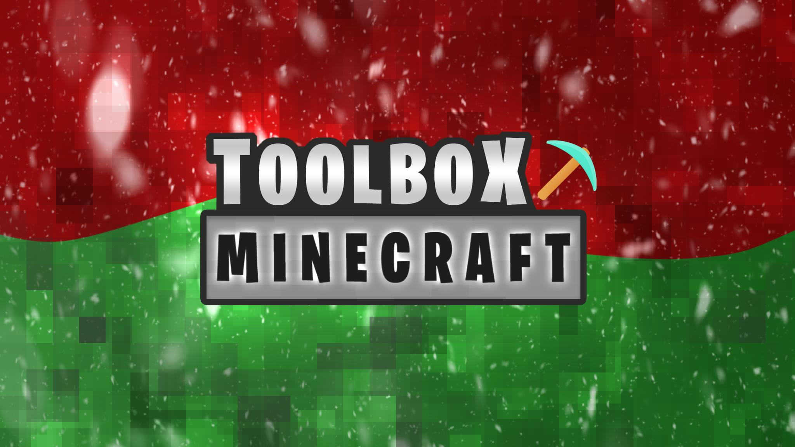

## Toolbox Archived Media

  <h3>Toolbox Events</h3>
  

    <a class="home-content-container" style="border-radius:8px;background: #111;padding:8px;color:#ccc;display:inline-block;margin:4px;line-height: 0;--color: #e74c3c;">
      
Lava Rising Champion

      
#e74c3c

    </a>
    <a class="home-content-container" style="border-radius:8px;background: #111;padding:8px;color:#ccc;display:inline-block;margin:4px;line-height: 0;--color: #00ffff;">
      
Skribbl Champion

      
#00ffff

    </a>
    <a class="home-content-container" style="border-radius:8px;background: #111;padding:8px;color:#ccc;display:inline-block;margin:4px;line-height: 0;--color: #7426ec;">
      
Build Battle King

      
#7426ec

    </a>
    <a class="home-content-container" style="border-radius:8px;background: #111;padding:8px;color:#ccc;display:inline-block;margin:4px;line-height: 0;--color: #26c1ec;">
      
Spleef Sovereign

      
#26c1ec

    </a>
    <a class="home-content-container" style="border-radius:8px;background: #111;padding:8px;color:#ccc;display:inline-block;margin:4px;line-height: 0;--color: #1f9409;">
      
Hunger Games Hero

      
#1f9409

    </a>
  

  <h3>Christmas 2022</h3>
  

    <a class="home-content-container" style="border-radius:8px;background: #111;padding:8px;color:#ccc;display:inline-block;margin:4px;line-height: 0;--color: #f8ecec;">
      
Snowball White

      
#f8ecec

    </a>
    <a class="home-content-container" style="border-radius:8px;background: #111;padding:8px;color:#ccc;display:inline-block;margin:4px;line-height: 0;--color: #f1c40f;">
      
Gold Ornament

      
#f1c40f

    </a>
    <a class="home-content-container" style="border-radius:8px;background: #111;padding:8px;color:#ccc;display:inline-block;margin:4px;line-height: 0;--color: #d32323;">
      
Red Stocking

      
#d32323

    </a>
    <a class="home-content-container" style="border-radius:8px;background: #111;padding:8px;color:#ccc;display:inline-block;margin:4px;line-height: 0;--color: #267f00;">
      
Green Tree

      
#267f00

    </a>
    

      
      
      
    

  

  <h3>Halloween 2022</h3>
  

    <a class="home-content-container" style="border-radius:8px;background: #111;padding:8px;color:#ccc;display:inline-block;margin:4px;line-height: 0;--color: #ff7d25;">
      
Pumpkin Orange

      
#ff7d25

    </a>
    <a class="home-content-container" style="border-radius:8px;background: #111;padding:8px;color:#ccc;display:inline-block;margin:4px;line-height: 0;--color: #7d0cd7;">
      
Potion Purple

      
#7d0cd7

    </a>
    <a class="home-content-container" style="border-radius:8px;background: #111;padding:8px;color:#ccc;display:inline-block;margin:4px;line-height: 0;--color: #98fe35;">
      
Acid Green

      
#98fe35

    </a>
    <a class="home-content-container" style="border-radius:8px;background: #eee;padding:8px;color:#ccc;display:inline-block;margin:4px;line-height: 0;--color: #29292c;">
      
Midnight Black

      
#29292c

    </a>
    

      
      
    

  

  <h3>Christmas 2021</h3>
  

    <a class="home-content-container" style="border-radius:8px;background: #111;padding:8px;color:#ccc;display:inline-block;margin:4px;line-height: 0;--color: #ffffff;">
      
Silver Snowman

      
#ffffff

    </a>
    <a class="home-content-container" style="border-radius:8px;background: #111;padding:8px;color:#ccc;display:inline-block;margin:4px;line-height: 0;--color: #ffc91f;">
      
Golden Star

      
#ffc91f

    </a>
    <a class="home-content-container" style="border-radius:8px;background: #111;padding:8px;color:#ccc;display:inline-block;margin:4px;line-height: 0;--color: #1d7f32;">
      
Mistletoe Wreath

      
#1d7f32

    </a>
    <a class="home-content-container" style="border-radius:8px;background: #111;padding:8px;color:#ccc;display:inline-block;margin:4px;line-height: 0;--color: #e00202;">
      
Ruby Ribbon

      
#e00202

    </a>
    

      
      
    

  

  <h3>50k Event Roles</h3>
  

    <a class="home-content-container" style="border-radius:8px;background: #111;padding:8px;color:#ccc;display:inline-block;margin:4px;line-height: 0;--color: #51e8cb;">
      
Toolbox Teal

      
#51e8cb

    </a>
    <a class="home-content-container" style="border-radius:8px;background: #111;padding:8px;color:#ccc;display:inline-block;margin:4px;line-height: 0;--color: #68d468;">
      
Toolbox Green

      
#68d468

    </a>
    <a class="home-content-container" style="border-radius:8px;background: #111;padding:8px;color:#ccc;display:inline-block;margin:4px;line-height: 0;--color: #ab825e;">
      
Toolbox Brown

      
#ab825e

    </a>
    <a class="home-content-container" style="border-radius:8px;background: #111;padding:8px;color:#ccc;display:inline-block;margin:4px;line-height: 0;--color: #e1963f;">
      
Toolbox Orange

      
#e1963f

    </a>
  

  <h3>April Fools 2021</h3>
  

    

      
    

  

